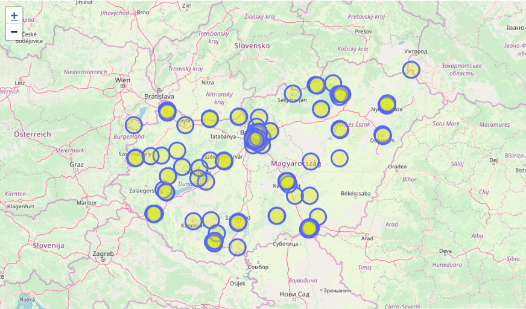

# OpenStreetMap Data Analytics

This repository contains a Python script (Jupyter notebook) implementing extraction of OpenStreetMap data with Spark.


## Getting Started

```
git clone https://github.com/bulutenesemre/OsmAnalysis

cd OsmAnalysis
```
## Prerequisites
We need convert the data set to Spark friendly format
Suggested tool: https://github.com/adrianulbona/osm-parquetizer

Also you need data,you can install it with related link ;

```
mkdir Data
cd Data
wget https://download.geofabrik.de/europe/hungary-latest.osm.pbf
```


## License

This project is licensed under the MIT License - see the [LICENSE](LICENSE) file for details

## Acknowledgments

* Data explore for only Hungary

## toDoList
- .sh file 
- Multicountry Data Analytics (For now default Hungary)
- SparkML with Data